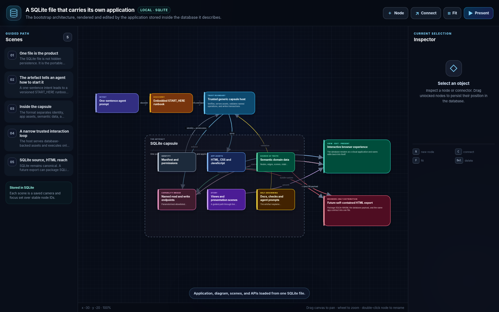

# SQLite Capsule reference implementation

SQLite Capsule explores a simple idea: one SQLite file can be an application,
a document, a data store, an interactive visualisation, and an agent-readable
software artefact at the same time.

This repository contains a format contract, generic hosts, authoring and
verification tools, and one complete example. It is a reference implementation,
not a production sandbox for arbitrary third-party code.

The distributable example is
[`capsules/diagram-studio.capsule.sqlite`](capsules/diagram-studio.capsule.sqlite).
It contains the Diagram Studio application, structured diagram data, named data
access declarations, validation checks, documentation, launch instructions, and
a compatible fallback host.



## What is included

- The current v0.2 SQLite format with an embedded `START_HERE` runbook.
- A Python standard-library host that binds only to loopback and exposes named,
  parameterised endpoints instead of raw SQL.
- A Windows native host with an independent Rust verifier, host-owned trust and
  capability decisions, a separate untrusted application renderer, backup and
  recovery controls, and offline release-policy verification.
- Three self-contained HTML export profiles backed by pinned SQLite WASM:
  `view`, `interactive`, and `editable`.
- Generic inspect, verify, conformance, permissions, unpack, pack, diff, signing,
  and export tools.
- Diagram Studio 0.3.0 as an offline visual editing example. The generic format
  and hosts contain no Diagram Studio domain logic.

## Run the example

Python 3.11 or later is recommended. No package installation or network access
is required for the loopback host.

```bash
python tools/capsule.py instructions capsules/diagram-studio.capsule.sqlite
python tools/capsule.py inspect capsules/diagram-studio.capsule.sqlite
python tools/capsule.py verify capsules/diagram-studio.capsule.sqlite
python tools/capsule.py start capsules/diagram-studio.capsule.sqlite --trust-capsule
```

The final command starts a detached server on `127.0.0.1`, verifies its capsule
identity, and prints the local URL. The explicit trust flag is appropriate only
for the checked-in repository example. Stop the matching host with:

```bash
python tools/capsule.py stop capsules/diagram-studio.capsule.sqlite
```

### Run it through Codex

Open this repository as a Codex project and send:

> Open `capsules/diagram-studio.capsule.sqlite`. Read its embedded `START_HERE` runbook, verify the capsule, and run it. Treat the database as the runtime source of truth and do not fetch dependencies. Report the healthy local URL.

The standalone instructions are in [`CODEX_START.md`](CODEX_START.md).

## Use the Windows native host

The native host is a visibly unsigned development build. Run it against a copy
of the example so experiments cannot be overwritten by a later clean rebuild:

```powershell
New-Item -ItemType Directory -Force .tmp\playground | Out-Null
Copy-Item capsules\diagram-studio.capsule.sqlite .tmp\playground\my-first.sqlitecapsule
python tools\capsule.py verify .tmp\playground\my-first.sqlitecapsule
cargo run --manifest-path native\Cargo.toml -p sqlite-capsule-desktop -- .tmp\playground\my-first.sqlitecapsule
```

Review the host-owned identity and capabilities before choosing **Allow once**.
The first write creates a verified backup outside the capsule directory.
Installers are generated build outputs and are not committed. See
[`native/README.md`](native/README.md) for build, test, and packaging commands.
To produce a signed application copy whose exact release can receive a durable
capability decision, configure the protected signing environment and run
`python tools/sign_release.py`. After choosing **Always for this release** once,
the unchanged valid signed release opens directly on later launches; see
[Automated release signing](docs/authoring.md#automated-release-signing).
Build a fast local NSIS setup executable with one repository-owned command:

```powershell
python native\tools\build_installers.py
```

The local default uses Cargo's debug profile and writes
`capsules\sqlite-capsule-host-setup.exe` as an ignored build output. Repackage
the existing debug executable without compiling Rust with
`python native\tools\build_installers.py --bundle-only`. Use `--release` only
when a fully optimized full-LTO binary is required; the GitHub release workflow
sets it explicitly. Bundle-only mode does not establish source freshness and is
intended only after a successful matching build. MSI packaging is skipped by
default and remains opt-in with
`python native\tools\build_installers.py --bundles msi`.
The wrapper accepts only the repository-pinned Tauri CLI version. It reuses an
exact matching installation or bootstraps it into ignored `native\.tools` on
the first run, which requires Cargo registry access.

GitHub does not build installers for pull requests. The lean CI workflow checks
the capsule, generated exports, Python suite, Rust workspace, SBOM, and license
inventory from a clean checkout. The release workflow performs the full native
UI and installer qualification only for manual dry runs and `vMAJOR.MINOR.PATCH`
tags; a tag run publishes the qualified files as GitHub Release assets.

## Export one browser-only file

```bash
python tools/capsule.py export-html capsules/diagram-studio.capsule.sqlite diagram-view.html --profile view
python tools/capsule.py inspect-html diagram-view.html
python tools/capsule.py verify-html diagram-view.html
```

Use `interactive` for read-only exploration and downloads, or `editable` for
the full editor plus explicit HTML revision saving. HTML remains a derivative:
it never silently rewrites the source `.capsule.sqlite` file. The checked export
matrix is in [`exports/manifest.json`](exports/manifest.json).

## Inspect and author capsules

```bash
python tools/capsule.py inspect capsules/diagram-studio.capsule.sqlite
python tools/capsule.py instructions capsules/diagram-studio.capsule.sqlite
python tools/capsule.py assets capsules/diagram-studio.capsule.sqlite
python tools/capsule.py unpack capsules/diagram-studio.capsule.sqlite reviewable-bundle
python tools/capsule.py pack reviewable-bundle rebuilt.capsule.sqlite
python tools/capsule.py diff capsules/diagram-studio.capsule.sqlite rebuilt.capsule.sqlite
```

`unpack` produces deterministic JSONL and content-addressed assets. `pack`
builds a new database and verifies it before publication; it never replaces an
existing output implicitly. See [`docs/authoring.md`](docs/authoring.md).

## Current limitations

- Internal hashes prove integrity, not publisher authenticity. Treat external
  capsules as untrusted until their publishers and executable assets have been
  verified through an appropriate trust path.
- Native implementation and automated acceptance currently target Windows
  x86-64. macOS and Linux native hosts are not supported by this repository.
- Native installers are unsigned development artefacts. Production signing,
  release roots, update endpoints, and clean-machine evidence are not supplied.
- HTML exports pass the pinned Chromium, Firefox, and Playwright WebKit matrix
  under static hosting. Direct local-file retesting and actual Safari acceptance
  remain documented gaps.
- There are no accounts, cloud sync, collaboration, plugin marketplace, or
  general filesystem or network APIs.

## Repository map

```text
docs/                         Format, architecture, security, and authoring docs
format/                       Current generic schema and conformance records
runtime/                      Python and browser host implementations
native/                       Independent Rust/Tauri/Wry Windows host
tools/                        Generic CLI, build, signing, and export tools
examples/diagram-studio/      Example-specific reviewable source
capsules/                     Generated distributable capsule
exports/                      Generated self-contained HTML derivatives
compatibility/                Cross-implementation extension test vectors
tests/                        Unit, browser, native, and visual regression tests
.agents/skills/               Repository-scoped Codex capsule runner
```

Start with the [documentation map](docs/index.md). Material design choices are
retained as [architecture decision records](docs/decisions/).

## Develop and verify

```bash
python tools/build_example.py
python -m unittest discover -s tests -v
python tools/capsule.py verify capsules/diagram-studio.capsule.sqlite
python tools/build_example.py --check
python tools/build_exports.py --check
```

Review [`CONTRIBUTING.md`](CONTRIBUTING.md) before changing schemas, runtime
boundaries, generated artefacts, or the native host.

## License

Repository code is available under the [MIT License](LICENSE). Vendored and
native third-party components retain their own licenses and notices.
